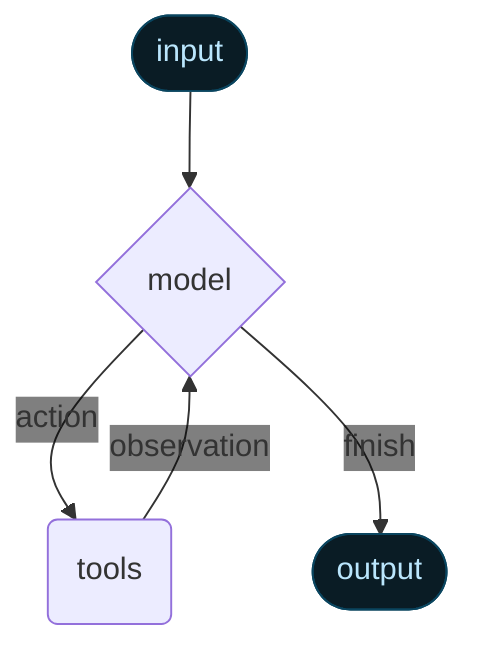

# What's new in v1

**LangChain v1 is a focused, production-ready foundation for building agents.** We've streamlined the framework around three core improvements:

<CardGroup cols={1}>
  <Card title="create_agent" icon="robot" href="#create-agent" arrow>
    The new standard for building agents in LangChain, replacing `langgraph.prebuilt.create_react_agent`.
  </Card>

  <Card title="Standard content blocks" icon="cube" href="#standard-content-blocks" arrow>
    A new `content_blocks` property that provides unified access to modern LLM features across providers.
  </Card>

  <Card title="Simplified namespace" icon="sitemap" href="#simplified-package" arrow>
    The `langchain` namespace has been streamlined to focus on essential building blocks for agents, with legacy functionality moved to `langchain-classic`.
  </Card>
</CardGroup>

To upgrade,

<CodeGroup>
  ```bash pip theme={null}
  pip install -U langchain
  ```

  ```bash uv theme={null}
  uv add langchain
  ```
</CodeGroup>

For a complete list of changes, see the [migration guide](/oss/python/migrate/langchain-v1).

## `create_agent`

[`create_agent`](https://reference.langchain.com/python/langchain/agents/#langchain.agents.create_agent) is the standard way to build agents in LangChain 1.0. It provides a simpler interface than [`langgraph.prebuilt.create_react_agent`](https://reference.langchain.com/python/langgraph/agents/#langgraph.prebuilt.chat_agent_executor.create_react_agent) while offering greater customization potential by using [middleware](#middleware).

```python  theme={null}
from langchain.agents import create_agent

agent = create_agent(
    model="claude-sonnet-4-5-20250929",
    tools=[search_web, analyze_data, send_email],
    system_prompt="You are a helpful research assistant."
)

result = agent.invoke({
    "messages": [
        {"role": "user", "content": "Research AI safety trends"}
    ]
})
```

Under the hood, [`create_agent`](https://reference.langchain.com/python/langchain/agents/#langchain.agents.create_agent) is built on the basic agent loop -- calling a model, letting it choose tools to execute, and then finishing when it calls no more tools:

<div style={{ display: "flex", justifyContent: "center" }}>
  
</div>

For more information, see [Agents](/oss/python/langchain/agents).

### Middleware

Middleware is the defining feature of [`create_agent`](https://reference.langchain.com/python/langchain/agents/#langchain.agents.create_agent). It offers a highly customizable entry-point, raising the ceiling for what you can build.

Great agents require [context engineering](/oss/python/langchain/context-engineering): getting the right information to the model at the right time. Middleware helps you control dynamic prompts, conversation summarization, selective tool access, state management, and guardrails through a composable abstraction.

#### Prebuilt middleware

LangChain provides a few [prebuilt middlewares](/oss/python/langchain/middleware#built-in-middleware) for common patterns, including:

* [`PIIMiddleware`](https://reference.langchain.com/python/langchain/middleware/#langchain.agents.middleware.PIIMiddleware): Redact sensitive information before sending to the model
* [`SummarizationMiddleware`](https://reference.langchain.com/python/langchain/middleware/#langchain.agents.middleware.SummarizationMiddleware): Condense conversation history when it gets too long
* [`HumanInTheLoopMiddleware`](https://reference.langchain.com/python/langchain/middleware/#langchain.agents.middleware.HumanInTheLoopMiddleware): Require approval for sensitive tool calls

```python  theme={null}
from langchain.agents import create_agent
from langchain.agents.middleware import (
    PIIMiddleware,
    SummarizationMiddleware,
    HumanInTheLoopMiddleware
)


agent = create_agent(
    model="claude-sonnet-4-5-20250929",
    tools=[read_email, send_email],
    middleware=[
        PIIMiddleware("email", strategy="redact", apply_to_input=True),
        PIIMiddleware(
            "phone_number",
            detector=(
                r"(?:\+?\d{1,3}[\s.-]?)?"
                r"(?:\(?\d{2,4}\)?[\s.-]?)?"
                r"\d{3,4}[\s.-]?\d{4}"
			),
			strategy="block"
        ),
        SummarizationMiddleware(
            model="claude-sonnet-4-5-20250929",
            max_tokens_before_summary=500
        ),
        HumanInTheLoopMiddleware(
            interrupt_on={
                "send_email": {
                    "allowed_decisions": ["approve", "edit", "reject"]
                }
            }
        ),
    ]
)
```

#### Custom middleware

You can also build custom middleware to fit your needs. Middleware exposes hooks at each step in an agent's execution:

<div style={{ display: "flex", justifyContent: "center" }}>
  
</div>

Build custom middleware by implementing any of these hooks on a subclass of the [`AgentMiddleware`](https://reference.langchain.com/python/langchain/middleware/#langchain.agents.middleware.AgentMiddleware) class:

| Hook              | When it runs             | Use cases                               |
| ----------------- | ------------------------ | --------------------------------------- |
| `before_agent`    | Before calling the agent | Load memory, validate input             |
| `before_model`    | Before each LLM call     | Update prompts, trim messages           |
| `wrap_model_call` | Around each LLM call     | Intercept and modify requests/responses |
| `wrap_tool_call`  | Around each tool call    | Intercept and modify tool execution     |
| `after_model`     | After each LLM response  | Validate output, apply guardrails       |
| `after_agent`     | After agent completes    | Save results, cleanup                   |

Example custom middleware:

```python expandable theme={null}
from dataclasses import dataclass
from typing import Callable

from langchain_openai import ChatOpenAI

from langchain.agents.middleware import (
    AgentMiddleware,
    ModelRequest
)
from langchain.agents.middleware.types import ModelResponse

@dataclass
class Context:
    user_expertise: str = "beginner"

class ExpertiseBasedToolMiddleware(AgentMiddleware):
    def wrap_model_call(
        self,
        request: ModelRequest,
        handler: Callable[[ModelRequest], ModelResponse]
    ) -> ModelResponse:
        user_level = request.runtime.context.user_expertise

        if user_level == "expert":
            # More powerful model
            model = ChatOpenAI(model="gpt-5")
            tools = [advanced_search, data_analysis]
        else:
            # Less powerful model
            model = ChatOpenAI(model="gpt-5-nano")
            tools = [simple_search, basic_calculator]

        request.model = model
        request.tools = tools
        return handler(request)

agent = create_agent(
    model="claude-sonnet-4-5-20250929",
    tools=[
        simple_search,
        advanced_search,
        basic_calculator,
        data_analysis
    ],
    middleware=[ExpertiseBasedToolMiddleware()],
    context_schema=Context
)
```

For more information, see [the complete middleware guide](/oss/python/langchain/middleware).

### Built on LangGraph

Because [`create_agent`](https://reference.langchain.com/python/langchain/agents/#langchain.agents.create_agent) is built on [LangGraph](/oss/python/langgraph), you automatically get built in support for long running and reliable agents via:

<CardGroup cols={2}>
  <Card title="Persistence" icon="database">
    Conversations automatically persist across sessions with built-in checkpointing
  </Card>

  <Card title="Streaming" icon="water">
    Stream tokens, tool calls, and reasoning traces in real-time
  </Card>

  <Card title="Human-in-the-loop" icon="hand">
    Pause agent execution for human approval before sensitive actions
  </Card>

  <Card title="Time travel" icon="clock-rotate-left">
    Rewind conversations to any point and explore alternate paths and prompts
  </Card>
</CardGroup>

You don't need to learn LangGraph to use these features—they work out of the box.

### Structured output

[`create_agent`](https://reference.langchain.com/python/langchain/agents/#langchain.agents.create_agent) has improved structured output generation:

* **Main loop integration**: Structured output is now generated in the main loop instead of requiring an additional LLM call
* **Structured output strategy**: Models can choose between calling tools or using provider-side structured output generation
* **Cost reduction**: Eliminates extra expense from additional LLM calls

```python  theme={null}
from langchain.agents import create_agent
from langchain.agents.structured_output import ToolStrategy
from pydantic import BaseModel


class Weather(BaseModel):
    temperature: float
    condition: str

def weather_tool(city: str) -> str:
    """Get the weather for a city."""
    return f"it's sunny and 70 degrees in {city}"

agent = create_agent(
    "gpt-4o-mini",
    tools=[weather_tool],
    response_format=ToolStrategy(Weather)
)

result = agent.invoke({
    "messages": [{"role": "user", "content": "What's the weather in SF?"}]
})

print(repr(result["structured_response"]))
# results in `Weather(temperature=70.0, condition='sunny')`
```

**Error handling**: Control error handling via the `handle_errors` parameter to `ToolStrategy`:

* **Parsing errors**: Model generates data that doesn't match desired structure
* **Multiple tool calls**: Model generates 2+ tool calls for structured output schemas

***

## Standard content blocks

<Note>
  Content block support is currently only available for the following integrations:

  * [`langchain-anthropic`](https://pypi.org/project/langchain-anthropic/)
  * [`langchain-aws`](https://pypi.org/project/langchain-aws/)
  * [`langchain-openai`](https://pypi.org/project/langchain-openai/)
  * [`langchain-google-genai`](https://pypi.org/project/langchain-google-genai/)
  * [`langchain-ollama`](https://pypi.org/project/langchain-ollama/)

  Broader support for content blocks will be rolled out gradually across more providers.
</Note>

The new [`content_blocks`](https://reference.langchain.com/python/langchain_core/language_models/#langchain_core.messages.BaseMessage.content_blocks) property introduces a standard representation for message content that works across providers:

```python  theme={null}
from langchain_anthropic import ChatAnthropic

model = ChatAnthropic(model="claude-sonnet-4-5-20250929")
response = model.invoke("What's the capital of France?")

# Unified access to content blocks
for block in response.content_blocks:
    if block["type"] == "reasoning":
        print(f"Model reasoning: {block['reasoning']}")
    elif block["type"] == "text":
        print(f"Response: {block['text']}")
    elif block["type"] == "tool_call":
        print(f"Tool call: {block['name']}({block['args']})")
```

### Benefits

* **Provider agnostic**: Access reasoning traces, citations, built-in tools (web search, code interpreters, etc.), and other features using the same API regardless of provider
* **Type safe**: Full type hints for all content block types
* **Backward compatible**: Standard content can be [loaded lazily](/oss/python/langchain/messages#standard-content-blocks), so there are no associated breaking changes

For more information, see our guide on [content blocks](/oss/python/langchain/messages#standard-content-blocks).

***

## Simplified package

LangChain v1 streamlines the [`langchain`](https://pypi.org/project/langchain/) package namespace to focus on essential building blocks for agents. The refined namespace exposes the most useful and relevant functionality:

### Namespace

| Module                                                                                | What's available                                                                                                                                                                                                                                                          | Notes                                 |
| ------------------------------------------------------------------------------------- | ------------------------------------------------------------------------------------------------------------------------------------------------------------------------------------------------------------------------------------------------------------------------- | ------------------------------------- |
| [`langchain.agents`](https://reference.langchain.com/python/langchain/agents)         | [`create_agent`](https://reference.langchain.com/python/langchain/agents/#langchain.agents.create_agent), [`AgentState`](https://reference.langchain.com/python/langchain/agents/#langchain.agents.AgentState)                                                            | Core agent creation functionality     |
| [`langchain.messages`](https://reference.langchain.com/python/langchain/messages)     | Message types, [content blocks](https://reference.langchain.com/python/langchain/messages/#langchain.messages.ContentBlock), [`trim_messages`](https://reference.langchain.com/python/langchain/messages/#langchain.messages.trim_messages)                               | Re-exported from @\[`langchain-core`] |
| [`langchain.tools`](https://reference.langchain.com/python/langchain/tools)           | [`@tool`](https://reference.langchain.com/python/langchain/tools/#langchain.tools.tool), [`BaseTool`](https://reference.langchain.com/python/langchain/tools/#langchain.tools.BaseTool), injection helpers                                                                | Re-exported from @\[`langchain-core`] |
| [`langchain.chat_models`](https://reference.langchain.com/python/langchain/models)    | [`init_chat_model`](https://reference.langchain.com/python/langchain/models/#langchain.chat_models.init_chat_model), [`BaseChatModel`](https://reference.langchain.com/python/langchain_core/language_models/#langchain_core.language_models.chat_models.BaseChatModel)   | Unified model initialization          |
| [`langchain.embeddings`](https://reference.langchain.com/python/langchain/embeddings) | [`Embeddings`](https://reference.langchain.com/python/langchain_core/embeddings/#langchain_core.embeddings.embeddings.Embeddings), [`init_embeddings`](https://reference.langchain.com/python/langchain_core/embeddings/#langchain_core.embeddings.embeddings.Embeddings) | Embedding models                      |

Most of these are re-exported from `langchain-core` for convenience, which gives you a focused API surface for building agents.

```python  theme={null}
# Agent building
from langchain.agents import create_agent

# Messages and content
from langchain.messages import AIMessage, HumanMessage

# Tools
from langchain.tools import tool

# Model initialization
from langchain.chat_models import init_chat_model
from langchain.embeddings import init_embeddings
```

### `langchain-classic`

Legacy functionality has moved to [`langchain-classic`](https://pypi.org/project/langchain-classic) to keep the core packages lean and focused.

**What's in `langchain-classic`:**

* Legacy chains and chain implementations
* Retrievers (e.g. `MultiQueryRetriever` or anything from the previous `langchain.retrievers` module)
* The indexing API
* The hub module (for managing prompts programmatically)
* [`langchain-community`](https://pypi.org/project/langchain-community) exports
* Other deprecated functionality

If you use any of this functionality, install [`langchain-classic`](https://pypi.org/project/langchain-classic):

<CodeGroup>
  ```bash pip theme={null}
  pip install langchain-classic
  ```

  ```bash uv theme={null}
  uv add langchain-classic
  ```
</CodeGroup>

Then update your imports:

```python  theme={null}
from langchain import ...  # [!code --]
from langchain_classic import ...  # [!code ++]

from langchain.chains import ...  # [!code --]
from langchain_classic.chains import ...  # [!code ++]

from langchain.retrievers import ...  # [!code --]
from langchain_classic.retrievers import ...  # [!code ++]

from langchain import hub  # [!code --]
from langchain_classic import hub  # [!code ++]
```

## Migration guide

See our [migration guide](/oss/python/migrate/langchain-v1) for help updating your code to LangChain v1.

## Reporting issues

Please report any issues discovered with 1.0 on [GitHub](https://github.com/langchain-ai/langchain/issues) using the `'v1'` [label](https://github.com/langchain-ai/langchain/issues?q=state%3Aopen%20label%3Av1).

## Additional resources

<CardGroup cols={3}>
  <Card title="LangChain 1.0" icon="rocket" href="https://blog.langchain.com/langchain-langchain-1-0-alpha-releases/">
    Read the announcement
  </Card>

  <Card title="Middleware Guide" icon="puzzle-piece" href="https://blog.langchain.com/agent-middleware/">
    Deep dive into middleware
  </Card>

  <Card title="Agents Documentation" icon="book" href="/oss/python/langchain/agents" arrow>
    Full agent documentation
  </Card>

  <Card title="Message Content" icon="message" href="/oss/python/langchain/messages#message-content" arrow>
    New content blocks API
  </Card>

  <Card title="Migration guide" icon="arrow-right-arrow-left" href="/oss/python/migrate/langchain-v1" arrow>
    How to migrate to LangChain v1
  </Card>

  <Card title="GitHub" icon="github" href="https://github.com/langchain-ai/langchain">
    Report issues or contribute
  </Card>
</CardGroup>

## See also

* [Versioning](/oss/python/versioning) - Understanding version numbers
* [Release policy](/oss/python/release-policy) - Detailed release policies

***

<Callout icon="pen-to-square" iconType="regular">
  [Edit the source of this page on GitHub.](https://github.com/langchain-ai/docs/edit/main/src/oss/python/releases/langchain-v1.mdx)
</Callout>

<Tip icon="terminal" iconType="regular">
  [Connect these docs programmatically](/use-these-docs) to Claude, VSCode, and more via MCP for    real-time answers.
</Tip>


# Quickstart

This quickstart takes you from a simple setup to a fully functional AI agent in just a few minutes.

## Build a basic agent

Start by creating a simple agent that can answer questions and call tools. The agent will use Claude Sonnet 4.5 as its language model, a basic weather function as a tool, and a simple prompt to guide its behavior.

<Info>
  For this example, you will need to set up a [Claude (Anthropic)](https://www.anthropic.com/) account and get an API key. Then, set the `ANTHROPIC_API_KEY` environment variable in your terminal.
</Info>

```python  theme={null}
from langchain.agents import create_agent

def get_weather(city: str) -> str:
    """Get weather for a given city."""
    return f"It's always sunny in {city}!"

agent = create_agent(
    model="claude-sonnet-4-5-20250929",
    tools=[get_weather],
    system_prompt="You are a helpful assistant",
)

# Run the agent
agent.invoke(
    {"messages": [{"role": "user", "content": "what is the weather in sf"}]}
)
```

<Tip>
  To learn how to trace your agent with LangSmith, see the [LangSmith documentation](/langsmith/trace-with-langchain).
</Tip>

## Build a real-world agent

Next, build a practical weather forecasting agent that demonstrates key production concepts:

1. **Detailed system prompts** for better agent behavior
2. **Create tools** that integrate with external data
3. **Model configuration** for consistent responses
4. **Structured output** for predictable results
5. **Conversational memory** for chat-like interactions
6. **Create and run the agent** create a fully functional agent

Let's walk through each step:

<Steps>
  <Step title="Define the system prompt">
    The system prompt defines your agent’s role and behavior. Keep it specific and actionable:

    ```python wrap theme={null}
    SYSTEM_PROMPT = """You are an expert weather forecaster, who speaks in puns.

    You have access to two tools:

    - get_weather_for_location: use this to get the weather for a specific location
    - get_user_location: use this to get the user's location

    If a user asks you for the weather, make sure you know the location. If you can tell from the question that they mean wherever they are, use the get_user_location tool to find their location."""
    ```
  </Step>

  <Step title="Create tools">
    [Tools](/oss/python/langchain/tools) let a model interact with external systems by calling functions you define.
    Tools can depend on [runtime context](/oss/python/langchain/runtime) and also interact with [agent memory](/oss/python/langchain/short-term-memory).

    Notice below how the `get_user_location` tool uses runtime context:

    ```python  theme={null}
    from dataclasses import dataclass
    from langchain.tools import tool, ToolRuntime

    @tool
    def get_weather_for_location(city: str) -> str:
        """Get weather for a given city."""
        return f"It's always sunny in {city}!"

    @dataclass
    class Context:
        """Custom runtime context schema."""
        user_id: str

    @tool
    def get_user_location(runtime: ToolRuntime[Context]) -> str:
        """Retrieve user information based on user ID."""
        user_id = runtime.context.user_id
        return "Florida" if user_id == "1" else "SF"
    ```

    <Tip>
      Tools should be well-documented: their name, description, and argument names become part of the model's prompt.
      LangChain's [`@tool` decorator](https://reference.langchain.com/python/langchain/tools/#langchain.tools.tool) adds metadata and enables runtime injection via the `ToolRuntime` parameter.
    </Tip>
  </Step>

  <Step title="Configure your model">
    Set up your [language model](/oss/python/langchain/models) with the right [parameters](/oss/python/langchain/models#parameters) for your use case:

    ```python  theme={null}
    from langchain.chat_models import init_chat_model

    model = init_chat_model(
        "claude-sonnet-4-5-20250929",
        temperature=0.5,
        timeout=10,
        max_tokens=1000
    )
    ```
  </Step>

  <Step title="Define response format">
    Optionally, define a structured response format if you need the agent responses to match
    a specific schema.

    ```python  theme={null}
    from dataclasses import dataclass

    # We use a dataclass here, but Pydantic models are also supported.
    @dataclass
    class ResponseFormat:
        """Response schema for the agent."""
        # A punny response (always required)
        punny_response: str
        # Any interesting information about the weather if available
        weather_conditions: str | None = None
    ```
  </Step>

  <Step title="Add memory">
    Add [memory](/oss/python/langchain/short-term-memory) to your agent to maintain state across interactions. This allows
    the agent to remember previous conversations and context.

    ```python  theme={null}
    from langgraph.checkpoint.memory import InMemorySaver

    checkpointer = InMemorySaver()
    ```

    <Info>
      In production, use a persistent checkpointer that saves to a database.
      See [Add and manage memory](/oss/python/langgraph/add-memory#manage-short-term-memory) for more details.
    </Info>
  </Step>

  <Step title="Create and run the agent">
    Now assemble your agent with all the components and run it!

    ```python  theme={null}
    agent = create_agent(
        model=model,
        system_prompt=SYSTEM_PROMPT,
        tools=[get_user_location, get_weather_for_location],
        context_schema=Context,
        response_format=ResponseFormat,
        checkpointer=checkpointer
    )

    # `thread_id` is a unique identifier for a given conversation.
    config = {"configurable": {"thread_id": "1"}}

    response = agent.invoke(
        {"messages": [{"role": "user", "content": "what is the weather outside?"}]},
        config=config,
        context=Context(user_id="1")
    )

    print(response['structured_response'])
    # ResponseFormat(
    #     punny_response="Florida is still having a 'sun-derful' day! The sunshine is playing 'ray-dio' hits all day long! I'd say it's the perfect weather for some 'solar-bration'! If you were hoping for rain, I'm afraid that idea is all 'washed up' - the forecast remains 'clear-ly' brilliant!",
    #     weather_conditions="It's always sunny in Florida!"
    # )


    # Note that we can continue the conversation using the same `thread_id`.
    response = agent.invoke(
        {"messages": [{"role": "user", "content": "thank you!"}]},
        config=config,
        context=Context(user_id="1")
    )

    print(response['structured_response'])
    # ResponseFormat(
    #     punny_response="You're 'thund-erfully' welcome! It's always a 'breeze' to help you stay 'current' with the weather. I'm just 'cloud'-ing around waiting to 'shower' you with more forecasts whenever you need them. Have a 'sun-sational' day in the Florida sunshine!",
    #     weather_conditions=None
    # )
    ```
  </Step>
</Steps>

<Expandable title="Full example code">
  ```python  theme={null}
  from dataclasses import dataclass

  from langchain.agents import create_agent
  from langchain.chat_models import init_chat_model
  from langchain.tools import tool, ToolRuntime
  from langgraph.checkpoint.memory import InMemorySaver


  # Define system prompt
  SYSTEM_PROMPT = """You are an expert weather forecaster, who speaks in puns.

  You have access to two tools:

  - get_weather_for_location: use this to get the weather for a specific location
  - get_user_location: use this to get the user's location

  If a user asks you for the weather, make sure you know the location. If you can tell from the question that they mean wherever they are, use the get_user_location tool to find their location."""

  # Define context schema
  @dataclass
  class Context:
      """Custom runtime context schema."""
      user_id: str

  # Define tools
  @tool
  def get_weather_for_location(city: str) -> str:
      """Get weather for a given city."""
      return f"It's always sunny in {city}!"

  @tool
  def get_user_location(runtime: ToolRuntime[Context]) -> str:
      """Retrieve user information based on user ID."""
      user_id = runtime.context.user_id
      return "Florida" if user_id == "1" else "SF"

  # Configure model
  model = init_chat_model(
      "claude-sonnet-4-5-20250929",
      temperature=0
  )

  # Define response format
  @dataclass
  class ResponseFormat:
      """Response schema for the agent."""
      # A punny response (always required)
      punny_response: str
      # Any interesting information about the weather if available
      weather_conditions: str | None = None

  # Set up memory
  checkpointer = InMemorySaver()

  # Create agent
  agent = create_agent(
      model=model,
      system_prompt=SYSTEM_PROMPT,
      tools=[get_user_location, get_weather_for_location],
      context_schema=Context,
      response_format=ResponseFormat,
      checkpointer=checkpointer
  )

  # Run agent
  # `thread_id` is a unique identifier for a given conversation.
  config = {"configurable": {"thread_id": "1"}}

  response = agent.invoke(
      {"messages": [{"role": "user", "content": "what is the weather outside?"}]},
      config=config,
      context=Context(user_id="1")
  )

  print(response['structured_response'])
  # ResponseFormat(
  #     punny_response="Florida is still having a 'sun-derful' day! The sunshine is playing 'ray-dio' hits all day long! I'd say it's the perfect weather for some 'solar-bration'! If you were hoping for rain, I'm afraid that idea is all 'washed up' - the forecast remains 'clear-ly' brilliant!",
  #     weather_conditions="It's always sunny in Florida!"
  # )


  # Note that we can continue the conversation using the same `thread_id`.
  response = agent.invoke(
      {"messages": [{"role": "user", "content": "thank you!"}]},
      config=config,
      context=Context(user_id="1")
  )

  print(response['structured_response'])
  # ResponseFormat(
  #     punny_response="You're 'thund-erfully' welcome! It's always a 'breeze' to help you stay 'current' with the weather. I'm just 'cloud'-ing around waiting to 'shower' you with more forecasts whenever you need them. Have a 'sun-sational' day in the Florida sunshine!",
  #     weather_conditions=None
  # )
  ```
</Expandable>

<Tip>
  To learn how to trace your agent with LangSmith, see the [LangSmith documentation](/langsmith/trace-with-langchain).
</Tip>

Congratulations! You now have an AI agent that can:

* **Understand context** and remember conversations
* **Use multiple tools** intelligently
* **Provide structured responses** in a consistent format
* **Handle user-specific information** through context
* **Maintain conversation state** across interactions

***

<Callout icon="pen-to-square" iconType="regular">
  [Edit the source of this page on GitHub.](https://github.com/langchain-ai/docs/edit/main/src/oss/langchain/quickstart.mdx)
</Callout>

<Tip icon="terminal" iconType="regular">
  [Connect these docs programmatically](/use-these-docs) to Claude, VSCode, and more via MCP for    real-time answers.
</Tip>


# Agents

Agents combine language models with [tools](/oss/python/langchain/tools) to create systems that can reason about tasks, decide which tools to use, and iteratively work towards solutions.

[`create_agent`](https://reference.langchain.com/python/langchain/agents/#langchain.agents.create_agent) provides a production-ready agent implementation.

[An LLM Agent runs tools in a loop to achieve a goal](https://simonwillison.net/2025/Sep/18/agents/).
An agent runs until a stop condition is met - i.e., when the model emits a final output or an iteration limit is reached.


<Info>
  [`create_agent`](https://reference.langchain.com/python/langchain/agents/#langchain.agents.create_agent) builds a **graph**-based agent runtime using [LangGraph](/oss/python/langgraph/overview). A graph consists of nodes (steps) and edges (connections) that define how your agent processes information. The agent moves through this graph, executing nodes like the model node (which calls the model), the tools node (which executes tools), or middleware.

  Learn more about the [Graph API](/oss/python/langgraph/graph-api).
</Info>

## Core components

### Model

The [model](/oss/python/langchain/models) is the reasoning engine of your agent. It can be specified in multiple ways, supporting both static and dynamic model selection.

#### Static model

Static models are configured once when creating the agent and remain unchanged throughout execution. This is the most common and straightforward approach.

To initialize a static model from a <Tooltip tip="A string that follows the format `provider:model` (e.g. openai:gpt-5)" cta="See mappings" href="https://reference.langchain.com/python/langchain/models/#langchain.chat_models.init_chat_model(model_provider)">model identifier string</Tooltip>:

```python wrap theme={null}
from langchain.agents import create_agent

agent = create_agent(
    "gpt-5",
    tools=tools
)
```

<Tip>
  Model identifier strings support automatic inference (e.g., `"gpt-5"` will be inferred as `"openai:gpt-5"`). Refer to the [reference](https://reference.langchain.com/python/langchain/models/#langchain.chat_models.init_chat_model\(model_provider\)) to see a full list of model identifier string mappings.
</Tip>

For more control over the model configuration, initialize a model instance directly using the provider package. In this example, we use [`ChatOpenAI`](https://reference.langchain.com/python/integrations/langchain_openai/ChatOpenAI/). See [Chat models](/oss/python/integrations/chat) for other available chat model classes.

```python wrap theme={null}
from langchain.agents import create_agent
from langchain_openai import ChatOpenAI

model = ChatOpenAI(
    model="gpt-5",
    temperature=0.1,
    max_tokens=1000,
    timeout=30
    # ... (other params)
)
agent = create_agent(model, tools=tools)
```

Model instances give you complete control over configuration. Use them when you need to set specific [parameters](/oss/python/langchain/models#parameters) like `temperature`, `max_tokens`, `timeouts`, `base_url`, and other provider-specific settings. Refer to the [reference](/oss/python/integrations/providers/all_providers) to see available params and methods on your model.

#### Dynamic model

Dynamic models are selected at <Tooltip tip="The execution environment of your agent, containing immutable configuration and contextual data that persists throughout the agent's execution (e.g., user IDs, session details, or application-specific configuration).">runtime</Tooltip> based on the current <Tooltip tip="The data that flows through your agent's execution, including messages, custom fields, and any information that needs to be tracked and potentially modified during processing (e.g., user preferences or tool usage stats).">state</Tooltip> and context. This enables sophisticated routing logic and cost optimization.

To use a dynamic model, create middleware using the [`@wrap_model_call`](https://reference.langchain.com/python/langchain/middleware/#langchain.agents.middleware.wrap_model_call) decorator that modifies the model in the request:

```python  theme={null}
from langchain_openai import ChatOpenAI
from langchain.agents import create_agent
from langchain.agents.middleware import wrap_model_call, ModelRequest, ModelResponse


basic_model = ChatOpenAI(model="gpt-4o-mini")
advanced_model = ChatOpenAI(model="gpt-4o")

@wrap_model_call
def dynamic_model_selection(request: ModelRequest, handler) -> ModelResponse:
    """Choose model based on conversation complexity."""
    message_count = len(request.state["messages"])

    if message_count > 10:
        # Use an advanced model for longer conversations
        model = advanced_model
    else:
        model = basic_model

    request.model = model
    return handler(request)

agent = create_agent(
    model=basic_model,  # Default model
    tools=tools,
    middleware=[dynamic_model_selection]
)
```

<Warning>
  Pre-bound models (models with [`bind_tools`](https://reference.langchain.com/python/langchain_core/language_models/#langchain_core.language_models.chat_models.BaseChatModel.bind_tools) already called) are not supported when using structured output. If you need dynamic model selection with structured output, ensure the models passed to the middleware are not pre-bound.
</Warning>

<Tip>
  For model configuration details, see [Models](/oss/python/langchain/models). For dynamic model selection patterns, see [Dynamic model in middleware](/oss/python/langchain/middleware#dynamic-model).
</Tip>

### Tools

Tools give agents the ability to take actions. Agents go beyond simple model-only tool binding by facilitating:

* Multiple tool calls in sequence (triggered by a single prompt)
* Parallel tool calls when appropriate
* Dynamic tool selection based on previous results
* Tool retry logic and error handling
* State persistence across tool calls

For more information, see [Tools](/oss/python/langchain/tools).

#### Defining tools

Pass a list of tools to the agent.

```python wrap theme={null}
from langchain.tools import tool
from langchain.agents import create_agent


@tool
def search(query: str) -> str:
    """Search for information."""
    return f"Results for: {query}"

@tool
def get_weather(location: str) -> str:
    """Get weather information for a location."""
    return f"Weather in {location}: Sunny, 72°F"

agent = create_agent(model, tools=[search, get_weather])
```

If an empty tool list is provided, the agent will consist of a single LLM node without tool-calling capabilities.

#### Tool error handling

To customize how tool errors are handled, use the [`@wrap_tool_call`](https://reference.langchain.com/python/langchain/middleware/#langchain.agents.middleware.wrap_tool_call) decorator to create middleware:

```python wrap theme={null}
from langchain.agents import create_agent
from langchain.agents.middleware import wrap_tool_call
from langchain_core.messages import ToolMessage


@wrap_tool_call
def handle_tool_errors(request, handler):
    """Handle tool execution errors with custom messages."""
    try:
        return handler(request)
    except Exception as e:
        # Return a custom error message to the model
        return ToolMessage(
            content=f"Tool error: Please check your input and try again. ({str(e)})",
            tool_call_id=request.tool_call["id"]
        )

agent = create_agent(
    model="gpt-4o",
    tools=[search, get_weather],
    middleware=[handle_tool_errors]
)
```

The agent will return a [`ToolMessage`](https://reference.langchain.com/python/langchain/messages/#langchain.messages.ToolMessage) with the custom error message when a tool fails:

```python  theme={null}
[
    ...
    ToolMessage(
        content="Tool error: Please check your input and try again. (division by zero)",
        tool_call_id="..."
    ),
    ...
]
```

#### Tool use in the ReAct loop

Agents follow the ReAct ("Reasoning + Acting") pattern, alternating between brief reasoning steps with targeted tool calls and feeding the resulting observations into subsequent decisions until they can deliver a final answer.

<Accordion title="Example of ReAct loop">
  Prompt: Identify the current most popular wireless headphones and verify availability.

  ```
  ================================ Human Message =================================

  Find the most popular wireless headphones right now and check if they're in stock
  ```

  * **Reasoning**: "Popularity is time-sensitive, I need to use the provided search tool."
  * **Acting**: Call `search_products("wireless headphones")`

  ```
  ================================== Ai Message ==================================
  Tool Calls:
    search_products (call_abc123)
   Call ID: call_abc123
    Args:
      query: wireless headphones
  ```

  ```
  ================================= Tool Message =================================

  Found 5 products matching "wireless headphones". Top 5 results: WH-1000XM5, ...
  ```

  * **Reasoning**: "I need to confirm availability for the top-ranked item before answering."
  * **Acting**: Call `check_inventory("WH-1000XM5")`

  ```
  ================================== Ai Message ==================================
  Tool Calls:
    check_inventory (call_def456)
   Call ID: call_def456
    Args:
      product_id: WH-1000XM5
  ```

  ```
  ================================= Tool Message =================================

  Product WH-1000XM5: 10 units in stock
  ```

  * **Reasoning**: "I have the most popular model and its stock status. I can now answer the user's question."
  * **Acting**: Produce final answer

  ```
  ================================== Ai Message ==================================

  I found wireless headphones (model WH-1000XM5) with 10 units in stock...
  ```
</Accordion>

<Tip>
  To learn more about tools, see [Tools](/oss/python/langchain/tools).
</Tip>

### System prompt

You can shape how your agent approaches tasks by providing a prompt. The [`system_prompt`](https://reference.langchain.com/python/langchain/agents/#langchain.agents.create_agent\(system_prompt\)) parameter can be provided as a string:

```python wrap theme={null}
agent = create_agent(
    model,
    tools,
    system_prompt="You are a helpful assistant. Be concise and accurate."
)
```

When no [`system_prompt`](https://reference.langchain.com/python/langchain/agents/#langchain.agents.create_agent\(system_prompt\)) is provided, the agent will infer its task from the messages directly.

#### Dynamic system prompt

For more advanced use cases where you need to modify the system prompt based on runtime context or agent state, you can use [middleware](/oss/python/langchain/middleware).

The [`@dynamic_prompt`](https://reference.langchain.com/python/langchain/middleware/#langchain.agents.middleware.dynamic_prompt) decorator creates middleware that generates system prompts dynamically based on the model request:

```python wrap theme={null}
from typing import TypedDict

from langchain.agents import create_agent
from langchain.agents.middleware import dynamic_prompt, ModelRequest


class Context(TypedDict):
    user_role: str

@dynamic_prompt
def user_role_prompt(request: ModelRequest) -> str:
    """Generate system prompt based on user role."""
    user_role = request.runtime.context.get("user_role", "user")
    base_prompt = "You are a helpful assistant."

    if user_role == "expert":
        return f"{base_prompt} Provide detailed technical responses."
    elif user_role == "beginner":
        return f"{base_prompt} Explain concepts simply and avoid jargon."

    return base_prompt

agent = create_agent(
    model="gpt-4o",
    tools=[web_search],
    middleware=[user_role_prompt],
    context_schema=Context
)

# The system prompt will be set dynamically based on context
result = agent.invoke(
    {"messages": [{"role": "user", "content": "Explain machine learning"}]},
    context={"user_role": "expert"}
)
```

<Tip>
  For more details on message types and formatting, see [Messages](/oss/python/langchain/messages). For comprehensive middleware documentation, see [Middleware](/oss/python/langchain/middleware).
</Tip>

## Invocation

You can invoke an agent by passing an update to its [`State`](/oss/python/langgraph/graph-api#state). All agents include a [sequence of messages](/oss/python/langgraph/use-graph-api#messagesstate) in their state; to invoke the agent, pass a new message:

```python  theme={null}
result = agent.invoke(
    {"messages": [{"role": "user", "content": "What's the weather in San Francisco?"}]}
)
```

For streaming steps and / or tokens from the agent, refer to the [streaming](/oss/python/langchain/streaming) guide.

Otherwise, the agent follows the LangGraph [Graph API](/oss/python/langgraph/use-graph-api) and supports all associated methods.

## Advanced concepts

### Structured output

In some situations, you may want the agent to return an output in a specific format. LangChain provides strategies for structured output via the [`response_format`](https://reference.langchain.com/python/langchain/middleware/#langchain.agents.middleware.ModelRequest\(response_format\)) parameter.

#### ToolStrategy

`ToolStrategy` uses artificial tool calling to generate structured output. This works with any model that supports tool calling:

```python wrap theme={null}
from pydantic import BaseModel
from langchain.agents import create_agent
from langchain.agents.structured_output import ToolStrategy


class ContactInfo(BaseModel):
    name: str
    email: str
    phone: str

agent = create_agent(
    model="gpt-4o-mini",
    tools=[search_tool],
    response_format=ToolStrategy(ContactInfo)
)

result = agent.invoke({
    "messages": [{"role": "user", "content": "Extract contact info from: John Doe, john@example.com, (555) 123-4567"}]
})

result["structured_response"]
# ContactInfo(name='John Doe', email='john@example.com', phone='(555) 123-4567')
```

#### ProviderStrategy

`ProviderStrategy` uses the model provider's native structured output generation. This is more reliable but only works with providers that support native structured output (e.g., OpenAI):

```python wrap theme={null}
from langchain.agents.structured_output import ProviderStrategy

agent = create_agent(
    model="gpt-4o",
    response_format=ProviderStrategy(ContactInfo)
)
```

<Note>
  As of `langchain 1.0`, simply passing a schema (e.g., `response_format=ContactInfo`) is no longer supported. You must explicitly use `ToolStrategy` or `ProviderStrategy`.
</Note>

<Tip>
  To learn about structured output, see [Structured output](/oss/python/langchain/structured-output).
</Tip>

### Memory

Agents maintain conversation history automatically through the message state. You can also configure the agent to use a custom state schema to remember additional information during the conversation.

Information stored in the state can be thought of as the [short-term memory](/oss/python/langchain/short-term-memory) of the agent:

Custom state schemas must extend [`AgentState`](https://reference.langchain.com/python/langchain/agents/#langchain.agents.AgentState) as a `TypedDict`.

There are two ways to define custom state:

1. Via [middleware](/oss/python/langchain/middleware) (preferred)
2. Via [`state_schema`](https://reference.langchain.com/python/langchain/middleware/#langchain.agents.middleware.AgentMiddleware.state_schema) on [`create_agent`](https://reference.langchain.com/python/langchain/agents/#langchain.agents.create_agent)

<Note>
  Defining custom state via middleware is preferred over defining it via [`state_schema`](https://reference.langchain.com/python/langchain/middleware/#langchain.agents.middleware.AgentMiddleware.state_schema) on [`create_agent`](https://reference.langchain.com/python/langchain/agents/#langchain.agents.create_agent) because it allows you to keep state extensions conceptually scoped to the relevant middleware and tools.

  [`state_schema`](https://reference.langchain.com/python/langchain/middleware/#langchain.agents.middleware.AgentMiddleware.state_schema) is still supported for backwards compatibility on [`create_agent`](https://reference.langchain.com/python/langchain/agents/#langchain.agents.create_agent).
</Note>

#### Defining state via middleware

Use middleware to define custom state when your custom state needs to be accessed by specific middleware hooks and tools attached to said middleware.

```python  theme={null}
from langchain.agents import AgentState
from langchain.agents.middleware import AgentMiddleware
from typing import Any


class CustomState(AgentState):
    user_preferences: dict

class CustomMiddleware(AgentMiddleware):
    state_schema = CustomState
    tools = [tool1, tool2]

    def before_model(self, state: CustomState, runtime) -> dict[str, Any] | None:
        ...

agent = create_agent(
    model,
    tools=tools,
    middleware=[CustomMiddleware()]
)

# The agent can now track additional state beyond messages
result = agent.invoke({
    "messages": [{"role": "user", "content": "I prefer technical explanations"}],
    "user_preferences": {"style": "technical", "verbosity": "detailed"},
})
```

#### Defining state via `state_schema`

Use the [`state_schema`](https://reference.langchain.com/python/langchain/middleware/#langchain.agents.middleware.AgentMiddleware.state_schema) parameter as a shortcut to define custom state that is only used in tools.

```python  theme={null}
from langchain.agents import AgentState


class CustomState(AgentState):
    user_preferences: dict

agent = create_agent(
    model,
    tools=[tool1, tool2],
    state_schema=CustomState
)
# The agent can now track additional state beyond messages
result = agent.invoke({
    "messages": [{"role": "user", "content": "I prefer technical explanations"}],
    "user_preferences": {"style": "technical", "verbosity": "detailed"},
})
```

<Note>
  As of `langchain 1.0`, custom state schemas **must** be `TypedDict` types. Pydantic models and dataclasses are no longer supported. See the [v1 migration guide](/oss/python/migrate/langchain-v1#state-type-restrictions) for more details.
</Note>

<Tip>
  To learn more about memory, see [Memory](/oss/python/concepts/memory). For information on implementing long-term memory that persists across sessions, see [Long-term memory](/oss/python/langchain/long-term-memory).
</Tip>

### Streaming

We've seen how the agent can be called with `invoke` to get a final response. If the agent executes multiple steps, this may take a while. To show intermediate progress, we can stream back messages as they occur.

```python  theme={null}
for chunk in agent.stream({
    "messages": [{"role": "user", "content": "Search for AI news and summarize the findings"}]
}, stream_mode="values"):
    # Each chunk contains the full state at that point
    latest_message = chunk["messages"][-1]
    if latest_message.content:
        print(f"Agent: {latest_message.content}")
    elif latest_message.tool_calls:
        print(f"Calling tools: {[tc['name'] for tc in latest_message.tool_calls]}")
```

<Tip>
  For more details on streaming, see [Streaming](/oss/python/langchain/streaming).
</Tip>

### Middleware

[Middleware](/oss/python/langchain/middleware) provides powerful extensibility for customizing agent behavior at different stages of execution. You can use middleware to:

* Process state before the model is called (e.g., message trimming, context injection)
* Modify or validate the model's response (e.g., guardrails, content filtering)
* Handle tool execution errors with custom logic
* Implement dynamic model selection based on state or context
* Add custom logging, monitoring, or analytics

Middleware integrates seamlessly into the agent's execution graph, allowing you to intercept and modify data flow at key points without changing the core agent logic.

<Tip>
  For comprehensive middleware documentation including decorators like [`@before_model`](https://reference.langchain.com/python/langchain/middleware/#langchain.agents.middleware.before_model), [`@after_model`](https://reference.langchain.com/python/langchain/middleware/#langchain.agents.middleware.after_model), and [`@wrap_tool_call`](https://reference.langchain.com/python/langchain/middleware/#langchain.agents.middleware.wrap_tool_call), see [Middleware](/oss/python/langchain/middleware).
</Tip>

***

<Callout icon="pen-to-square" iconType="regular">
  [Edit the source of this page on GitHub.](https://github.com/langchain-ai/docs/edit/main/src/oss/langchain/agents.mdx)
</Callout>

<Tip icon="terminal" iconType="regular">
  [Connect these docs programmatically](/use-these-docs) to Claude, VSCode, and more via MCP for    real-time answers.
</Tip>


# Agents

Agents combine language models with [tools](/oss/python/langchain/tools) to create systems that can reason about tasks, decide which tools to use, and iteratively work towards solutions.

[`create_agent`](https://reference.langchain.com/python/langchain/agents/#langchain.agents.create_agent) provides a production-ready agent implementation.

[An LLM Agent runs tools in a loop to achieve a goal](https://simonwillison.net/2025/Sep/18/agents/).
An agent runs until a stop condition is met - i.e., when the model emits a final output or an iteration limit is reached.



<Info>
  [`create_agent`](https://reference.langchain.com/python/langchain/agents/#langchain.agents.create_agent) builds a **graph**-based agent runtime using [LangGraph](/oss/python/langgraph/overview). A graph consists of nodes (steps) and edges (connections) that define how your agent processes information. The agent moves through this graph, executing nodes like the model node (which calls the model), the tools node (which executes tools), or middleware.

  Learn more about the [Graph API](/oss/python/langgraph/graph-api).
</Info>

## Core components

### Model

The [model](/oss/python/langchain/models) is the reasoning engine of your agent. It can be specified in multiple ways, supporting both static and dynamic model selection.

#### Static model

Static models are configured once when creating the agent and remain unchanged throughout execution. This is the most common and straightforward approach.

To initialize a static model from a <Tooltip tip="A string that follows the format `provider:model` (e.g. openai:gpt-5)" cta="See mappings" href="https://reference.langchain.com/python/langchain/models/#langchain.chat_models.init_chat_model(model_provider)">model identifier string</Tooltip>:

```python wrap theme={null}
from langchain.agents import create_agent

agent = create_agent(
    "gpt-5",
    tools=tools
)
```

<Tip>
  Model identifier strings support automatic inference (e.g., `"gpt-5"` will be inferred as `"openai:gpt-5"`). Refer to the [reference](https://reference.langchain.com/python/langchain/models/#langchain.chat_models.init_chat_model\(model_provider\)) to see a full list of model identifier string mappings.
</Tip>

For more control over the model configuration, initialize a model instance directly using the provider package. In this example, we use [`ChatOpenAI`](https://reference.langchain.com/python/integrations/langchain_openai/ChatOpenAI/). See [Chat models](/oss/python/integrations/chat) for other available chat model classes.

```python wrap theme={null}
from langchain.agents import create_agent
from langchain_openai import ChatOpenAI

model = ChatOpenAI(
    model="gpt-5",
    temperature=0.1,
    max_tokens=1000,
    timeout=30
    # ... (other params)
)
agent = create_agent(model, tools=tools)
```

Model instances give you complete control over configuration. Use them when you need to set specific [parameters](/oss/python/langchain/models#parameters) like `temperature`, `max_tokens`, `timeouts`, `base_url`, and other provider-specific settings. Refer to the [reference](/oss/python/integrations/providers/all_providers) to see available params and methods on your model.

#### Dynamic model

Dynamic models are selected at <Tooltip tip="The execution environment of your agent, containing immutable configuration and contextual data that persists throughout the agent's execution (e.g., user IDs, session details, or application-specific configuration).">runtime</Tooltip> based on the current <Tooltip tip="The data that flows through your agent's execution, including messages, custom fields, and any information that needs to be tracked and potentially modified during processing (e.g., user preferences or tool usage stats).">state</Tooltip> and context. This enables sophisticated routing logic and cost optimization.

To use a dynamic model, create middleware using the [`@wrap_model_call`](https://reference.langchain.com/python/langchain/middleware/#langchain.agents.middleware.wrap_model_call) decorator that modifies the model in the request:

```python  theme={null}
from langchain_openai import ChatOpenAI
from langchain.agents import create_agent
from langchain.agents.middleware import wrap_model_call, ModelRequest, ModelResponse


basic_model = ChatOpenAI(model="gpt-4o-mini")
advanced_model = ChatOpenAI(model="gpt-4o")

@wrap_model_call
def dynamic_model_selection(request: ModelRequest, handler) -> ModelResponse:
    """Choose model based on conversation complexity."""
    message_count = len(request.state["messages"])

    if message_count > 10:
        # Use an advanced model for longer conversations
        model = advanced_model
    else:
        model = basic_model

    request.model = model
    return handler(request)

agent = create_agent(
    model=basic_model,  # Default model
    tools=tools,
    middleware=[dynamic_model_selection]
)
```

<Warning>
  Pre-bound models (models with [`bind_tools`](https://reference.langchain.com/python/langchain_core/language_models/#langchain_core.language_models.chat_models.BaseChatModel.bind_tools) already called) are not supported when using structured output. If you need dynamic model selection with structured output, ensure the models passed to the middleware are not pre-bound.
</Warning>

<Tip>
  For model configuration details, see [Models](/oss/python/langchain/models). For dynamic model selection patterns, see [Dynamic model in middleware](/oss/python/langchain/middleware#dynamic-model).
</Tip>

### Tools

Tools give agents the ability to take actions. Agents go beyond simple model-only tool binding by facilitating:

* Multiple tool calls in sequence (triggered by a single prompt)
* Parallel tool calls when appropriate
* Dynamic tool selection based on previous results
* Tool retry logic and error handling
* State persistence across tool calls

For more information, see [Tools](/oss/python/langchain/tools).

#### Defining tools

Pass a list of tools to the agent.

```python wrap theme={null}
from langchain.tools import tool
from langchain.agents import create_agent


@tool
def search(query: str) -> str:
    """Search for information."""
    return f"Results for: {query}"

@tool
def get_weather(location: str) -> str:
    """Get weather information for a location."""
    return f"Weather in {location}: Sunny, 72°F"

agent = create_agent(model, tools=[search, get_weather])
```

If an empty tool list is provided, the agent will consist of a single LLM node without tool-calling capabilities.

#### Tool error handling

To customize how tool errors are handled, use the [`@wrap_tool_call`](https://reference.langchain.com/python/langchain/middleware/#langchain.agents.middleware.wrap_tool_call) decorator to create middleware:

```python wrap theme={null}
from langchain.agents import create_agent
from langchain.agents.middleware import wrap_tool_call
from langchain_core.messages import ToolMessage


@wrap_tool_call
def handle_tool_errors(request, handler):
    """Handle tool execution errors with custom messages."""
    try:
        return handler(request)
    except Exception as e:
        # Return a custom error message to the model
        return ToolMessage(
            content=f"Tool error: Please check your input and try again. ({str(e)})",
            tool_call_id=request.tool_call["id"]
        )

agent = create_agent(
    model="gpt-4o",
    tools=[search, get_weather],
    middleware=[handle_tool_errors]
)
```

The agent will return a [`ToolMessage`](https://reference.langchain.com/python/langchain/messages/#langchain.messages.ToolMessage) with the custom error message when a tool fails:

```python  theme={null}
[
    ...
    ToolMessage(
        content="Tool error: Please check your input and try again. (division by zero)",
        tool_call_id="..."
    ),
    ...
]
```

#### Tool use in the ReAct loop

Agents follow the ReAct ("Reasoning + Acting") pattern, alternating between brief reasoning steps with targeted tool calls and feeding the resulting observations into subsequent decisions until they can deliver a final answer.

<Accordion title="Example of ReAct loop">
  Prompt: Identify the current most popular wireless headphones and verify availability.

  ```
  ================================ Human Message =================================

  Find the most popular wireless headphones right now and check if they're in stock
  ```

  * **Reasoning**: "Popularity is time-sensitive, I need to use the provided search tool."
  * **Acting**: Call `search_products("wireless headphones")`

  ```
  ================================== Ai Message ==================================
  Tool Calls:
    search_products (call_abc123)
   Call ID: call_abc123
    Args:
      query: wireless headphones
  ```

  ```
  ================================= Tool Message =================================

  Found 5 products matching "wireless headphones". Top 5 results: WH-1000XM5, ...
  ```

  * **Reasoning**: "I need to confirm availability for the top-ranked item before answering."
  * **Acting**: Call `check_inventory("WH-1000XM5")`

  ```
  ================================== Ai Message ==================================
  Tool Calls:
    check_inventory (call_def456)
   Call ID: call_def456
    Args:
      product_id: WH-1000XM5
  ```

  ```
  ================================= Tool Message =================================

  Product WH-1000XM5: 10 units in stock
  ```

  * **Reasoning**: "I have the most popular model and its stock status. I can now answer the user's question."
  * **Acting**: Produce final answer

  ```
  ================================== Ai Message ==================================

  I found wireless headphones (model WH-1000XM5) with 10 units in stock...
  ```
</Accordion>

<Tip>
  To learn more about tools, see [Tools](/oss/python/langchain/tools).
</Tip>

### System prompt

You can shape how your agent approaches tasks by providing a prompt. The [`system_prompt`](https://reference.langchain.com/python/langchain/agents/#langchain.agents.create_agent\(system_prompt\)) parameter can be provided as a string:

```python wrap theme={null}
agent = create_agent(
    model,
    tools,
    system_prompt="You are a helpful assistant. Be concise and accurate."
)
```

When no [`system_prompt`](https://reference.langchain.com/python/langchain/agents/#langchain.agents.create_agent\(system_prompt\)) is provided, the agent will infer its task from the messages directly.

#### Dynamic system prompt

For more advanced use cases where you need to modify the system prompt based on runtime context or agent state, you can use [middleware](/oss/python/langchain/middleware).

The [`@dynamic_prompt`](https://reference.langchain.com/python/langchain/middleware/#langchain.agents.middleware.dynamic_prompt) decorator creates middleware that generates system prompts dynamically based on the model request:

```python wrap theme={null}
from typing import TypedDict

from langchain.agents import create_agent
from langchain.agents.middleware import dynamic_prompt, ModelRequest


class Context(TypedDict):
    user_role: str

@dynamic_prompt
def user_role_prompt(request: ModelRequest) -> str:
    """Generate system prompt based on user role."""
    user_role = request.runtime.context.get("user_role", "user")
    base_prompt = "You are a helpful assistant."

    if user_role == "expert":
        return f"{base_prompt} Provide detailed technical responses."
    elif user_role == "beginner":
        return f"{base_prompt} Explain concepts simply and avoid jargon."

    return base_prompt

agent = create_agent(
    model="gpt-4o",
    tools=[web_search],
    middleware=[user_role_prompt],
    context_schema=Context
)

# The system prompt will be set dynamically based on context
result = agent.invoke(
    {"messages": [{"role": "user", "content": "Explain machine learning"}]},
    context={"user_role": "expert"}
)
```

<Tip>
  For more details on message types and formatting, see [Messages](/oss/python/langchain/messages). For comprehensive middleware documentation, see [Middleware](/oss/python/langchain/middleware).
</Tip>

## Invocation

You can invoke an agent by passing an update to its [`State`](/oss/python/langgraph/graph-api#state). All agents include a [sequence of messages](/oss/python/langgraph/use-graph-api#messagesstate) in their state; to invoke the agent, pass a new message:

```python  theme={null}
result = agent.invoke(
    {"messages": [{"role": "user", "content": "What's the weather in San Francisco?"}]}
)
```

For streaming steps and / or tokens from the agent, refer to the [streaming](/oss/python/langchain/streaming) guide.

Otherwise, the agent follows the LangGraph [Graph API](/oss/python/langgraph/use-graph-api) and supports all associated methods.

## Advanced concepts

### Structured output

In some situations, you may want the agent to return an output in a specific format. LangChain provides strategies for structured output via the [`response_format`](https://reference.langchain.com/python/langchain/middleware/#langchain.agents.middleware.ModelRequest\(response_format\)) parameter.

#### ToolStrategy

`ToolStrategy` uses artificial tool calling to generate structured output. This works with any model that supports tool calling:

```python wrap theme={null}
from pydantic import BaseModel
from langchain.agents import create_agent
from langchain.agents.structured_output import ToolStrategy


class ContactInfo(BaseModel):
    name: str
    email: str
    phone: str

agent = create_agent(
    model="gpt-4o-mini",
    tools=[search_tool],
    response_format=ToolStrategy(ContactInfo)
)

result = agent.invoke({
    "messages": [{"role": "user", "content": "Extract contact info from: John Doe, john@example.com, (555) 123-4567"}]
})

result["structured_response"]
# ContactInfo(name='John Doe', email='john@example.com', phone='(555) 123-4567')
```

#### ProviderStrategy

`ProviderStrategy` uses the model provider's native structured output generation. This is more reliable but only works with providers that support native structured output (e.g., OpenAI):

```python wrap theme={null}
from langchain.agents.structured_output import ProviderStrategy

agent = create_agent(
    model="gpt-4o",
    response_format=ProviderStrategy(ContactInfo)
)
```

<Note>
  As of `langchain 1.0`, simply passing a schema (e.g., `response_format=ContactInfo`) is no longer supported. You must explicitly use `ToolStrategy` or `ProviderStrategy`.
</Note>

<Tip>
  To learn about structured output, see [Structured output](/oss/python/langchain/structured-output).
</Tip>

### Memory

Agents maintain conversation history automatically through the message state. You can also configure the agent to use a custom state schema to remember additional information during the conversation.

Information stored in the state can be thought of as the [short-term memory](/oss/python/langchain/short-term-memory) of the agent:

Custom state schemas must extend [`AgentState`](https://reference.langchain.com/python/langchain/agents/#langchain.agents.AgentState) as a `TypedDict`.

There are two ways to define custom state:

1. Via [middleware](/oss/python/langchain/middleware) (preferred)
2. Via [`state_schema`](https://reference.langchain.com/python/langchain/middleware/#langchain.agents.middleware.AgentMiddleware.state_schema) on [`create_agent`](https://reference.langchain.com/python/langchain/agents/#langchain.agents.create_agent)

<Note>
  Defining custom state via middleware is preferred over defining it via [`state_schema`](https://reference.langchain.com/python/langchain/middleware/#langchain.agents.middleware.AgentMiddleware.state_schema) on [`create_agent`](https://reference.langchain.com/python/langchain/agents/#langchain.agents.create_agent) because it allows you to keep state extensions conceptually scoped to the relevant middleware and tools.

  [`state_schema`](https://reference.langchain.com/python/langchain/middleware/#langchain.agents.middleware.AgentMiddleware.state_schema) is still supported for backwards compatibility on [`create_agent`](https://reference.langchain.com/python/langchain/agents/#langchain.agents.create_agent).
</Note>

#### Defining state via middleware

Use middleware to define custom state when your custom state needs to be accessed by specific middleware hooks and tools attached to said middleware.

```python  theme={null}
from langchain.agents import AgentState
from langchain.agents.middleware import AgentMiddleware
from typing import Any


class CustomState(AgentState):
    user_preferences: dict

class CustomMiddleware(AgentMiddleware):
    state_schema = CustomState
    tools = [tool1, tool2]

    def before_model(self, state: CustomState, runtime) -> dict[str, Any] | None:
        ...

agent = create_agent(
    model,
    tools=tools,
    middleware=[CustomMiddleware()]
)

# The agent can now track additional state beyond messages
result = agent.invoke({
    "messages": [{"role": "user", "content": "I prefer technical explanations"}],
    "user_preferences": {"style": "technical", "verbosity": "detailed"},
})
```

#### Defining state via `state_schema`

Use the [`state_schema`](https://reference.langchain.com/python/langchain/middleware/#langchain.agents.middleware.AgentMiddleware.state_schema) parameter as a shortcut to define custom state that is only used in tools.

```python  theme={null}
from langchain.agents import AgentState


class CustomState(AgentState):
    user_preferences: dict

agent = create_agent(
    model,
    tools=[tool1, tool2],
    state_schema=CustomState
)
# The agent can now track additional state beyond messages
result = agent.invoke({
    "messages": [{"role": "user", "content": "I prefer technical explanations"}],
    "user_preferences": {"style": "technical", "verbosity": "detailed"},
})
```

<Note>
  As of `langchain 1.0`, custom state schemas **must** be `TypedDict` types. Pydantic models and dataclasses are no longer supported. See the [v1 migration guide](/oss/python/migrate/langchain-v1#state-type-restrictions) for more details.
</Note>

<Tip>
  To learn more about memory, see [Memory](/oss/python/concepts/memory). For information on implementing long-term memory that persists across sessions, see [Long-term memory](/oss/python/langchain/long-term-memory).
</Tip>

### Streaming

We've seen how the agent can be called with `invoke` to get a final response. If the agent executes multiple steps, this may take a while. To show intermediate progress, we can stream back messages as they occur.

```python  theme={null}
for chunk in agent.stream({
    "messages": [{"role": "user", "content": "Search for AI news and summarize the findings"}]
}, stream_mode="values"):
    # Each chunk contains the full state at that point
    latest_message = chunk["messages"][-1]
    if latest_message.content:
        print(f"Agent: {latest_message.content}")
    elif latest_message.tool_calls:
        print(f"Calling tools: {[tc['name'] for tc in latest_message.tool_calls]}")
```

<Tip>
  For more details on streaming, see [Streaming](/oss/python/langchain/streaming).
</Tip>

### Middleware

[Middleware](/oss/python/langchain/middleware) provides powerful extensibility for customizing agent behavior at different stages of execution. You can use middleware to:

* Process state before the model is called (e.g., message trimming, context injection)
* Modify or validate the model's response (e.g., guardrails, content filtering)
* Handle tool execution errors with custom logic
* Implement dynamic model selection based on state or context
* Add custom logging, monitoring, or analytics

Middleware integrates seamlessly into the agent's execution graph, allowing you to intercept and modify data flow at key points without changing the core agent logic.

<Tip>
  For comprehensive middleware documentation including decorators like [`@before_model`](https://reference.langchain.com/python/langchain/middleware/#langchain.agents.middleware.before_model), [`@after_model`](https://reference.langchain.com/python/langchain/middleware/#langchain.agents.middleware.after_model), and [`@wrap_tool_call`](https://reference.langchain.com/python/langchain/middleware/#langchain.agents.middleware.wrap_tool_call), see [Middleware](/oss/python/langchain/middleware).
</Tip>

***

<Callout icon="pen-to-square" iconType="regular">
  [Edit the source of this page on GitHub.](https://github.com/langchain-ai/docs/edit/main/src/oss/langchain/agents.mdx)
</Callout>

<Tip icon="terminal" iconType="regular">
  [Connect these docs programmatically](/use-these-docs) to Claude, VSCode, and more via MCP for    real-time answers.
</Tip>
